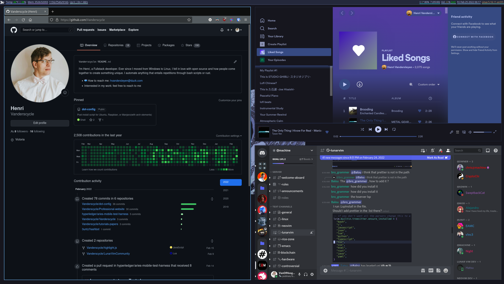
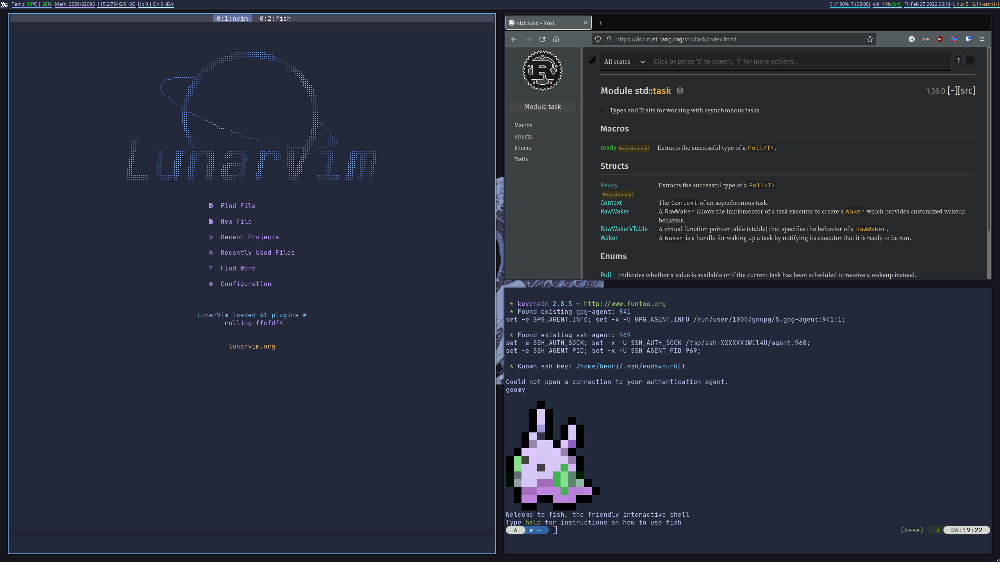
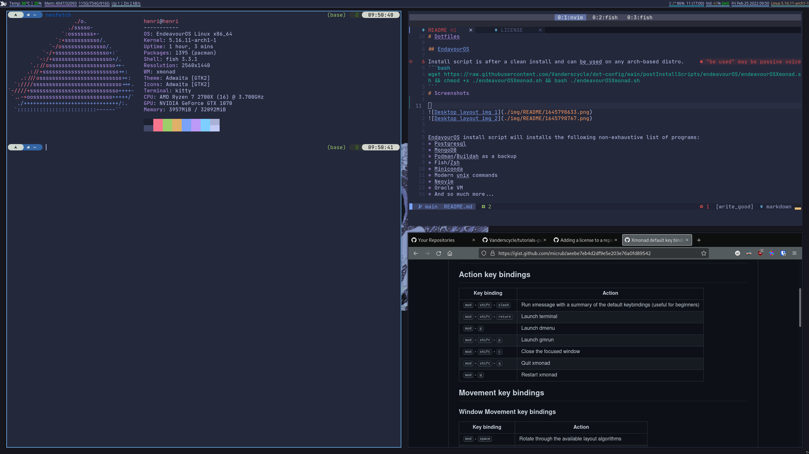

# Dotfiles

I use this repo to hold my dotfiles in one place, and feel free to submit a pr.
There's a backlog list of old issues found in the [todo.md](./todo.md) that I will go through when time and priority permits

## EndavourOS

Install script is after a clean install and can be used on any arch-based distro.

```bash
wget https://raw.githubusercontent.com/Vanderscycle/dot-config/main/postInstallScripts/endeavourOS/endeavourOSXmonad.sh && chmod +x ./endeavourOSXmonad.sh && bash ./endeavourOSXmonad.sh -w xmonad -h
```

# Screenshots

- WM: Xmonad
- Colorscheme: tokyonightDark
- IDE: Neovim(LunarVim)
- Terminal: kitty
- Shell: Fish(zsh config available)





## Bindings

- WM [navigation](https://gist.github.com/micrub/aeebe7eb4d2df9e5e203e76a0fd89542)

## Installed programs

EndavourOS install script will installs the following non-exhaustive list of programs:

- Postgresql
- MongoDB
- Podman/Buildah as a backup
- Fish/Zsh
- Miniconda
- Modern unix commands
- Neovim
- Oracle VM
- And so much more...
