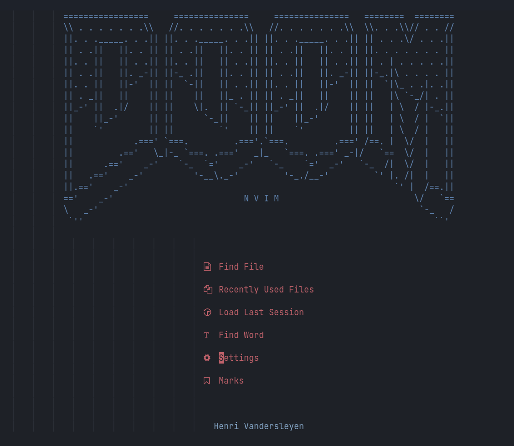

# warning
Messy code ahead, if you need some help please send me an email and I can help you if you are trying to replace anything.

At the moment, I am using lunar vim instead of my deprecated nvim

# Dotfiles

:TODO
- update Ubuntu
- update raspbian


## Ubuntu
My .dotfile repo containing all relevant configurations that I use.

To use the post-install script for Ubuntu ssh into the Ubuntu server and type:
```bash
wget -O /etc/init.d/ubuntuPostInstall.sh https://raw.githubusercontent.com/Vanderscycle/dot-config/main/postInstallScripts/ubuntuPostInstall.sh && chmod +x /etc/init.d/ubuntuPostInstall.sh && bash /etc/init.d/ubuntuPostInstall.sh
``` 
It will however require a reboot.

The post install script installs the following programs:
* Postgresql
* MongoDB
* Docker
* Miniconda
* Oh-my-zsh (p10k theme)
* tmux
* nvim with plugins 
 
## Arch/Manjaro
```bash
sudo mkdir /etc/init.d/ && sudo wget -O /etc/init.d/Manjaro-Arch-temp.sh https://raw.githubusercontent.com/Vanderscycle/dot-config/main/postInstallScripts/Manjaro-Arch-temp.sh && sudo chmod +x /etc/init.d/Manjaro-Arch-temp.sh && bash /etc/init.d/Manjaro-Arch-temp.sh
``` 

## Raspbian
```bash
wget -O /etc/init.d/raspberryPi.sh https://raw.githubusercontent.com/Vanderscycle/dot-config/main/postInstallScripts/raspberryPi.sh && chmod +x /etc/init.d/raspberryPi.sh && bash /etc/init.d/raspberryPi.sh
```
